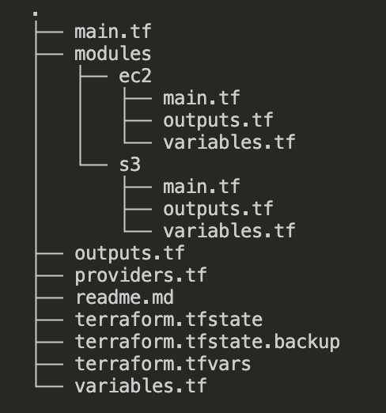

# Terraform EC2 + S3 Modules

This Terraform project provisions an **EC2 instance** and **secure S3 buckets** on AWS using a **modular approach**.  

## Project Structure

 

## Modules

### 1. EC2 Module (\`modules/ec2\`)

- Launches an EC2 instance
- Attaches an Elastic IP (EIP)
- Accepts the following variables:
  - \`instance_type\` – EC2 instance type (\`t2.micro\` or \`t3.micro\`)
  - \`key_name\` – SSH key pair
  - \`subnet_id\` – Subnet where EC2 is launched
  - \`sg_id\` – Security group ID
  - \`common_tags\` – Tags applied to all resources
- Outputs:
  - \`instance_id\`
  - \`eip\`
  - \`ec2_public_dns\`

### 2. S3 Module (\`modules/s3\`)

- Creates two S3 buckets:
  - **Log bucket** (for storing access logs)
  - **Secure bucket** (main bucket with logging, versioning, encryption, public access block, and bucket policy)
- Accepts the following variables:
  - \`log_bucket_name\` – Name for log bucket
  - \`secure_bucket_name\` – Name for secure bucket
  - \`versioning_status\` – \`Enabled\` or \`Suspended\`
  - \`common_tags\` – Tags applied to all resources
- Outputs:
  - \`log_bucket_name\`
  - \`secure_bucket_name\`

## Root Configuration

- Calls both EC2 and S3 modules
- Defines provider configuration in \`providers.tf\`
- Defines root-level variables and outputs
- Root-level \`terraform.tfvars\` provides actual values

## Usage

1. Initialize Terraform:

\`\`\`bash
terraform init
\`\`\`

2. Preview the execution plan:

\`\`\`bash
terraform plan
\`\`\`

3. Apply the configuration:

\`\`\`bash
terraform apply
\`\`\`

4. Access outputs:

\`\`\`bash
terraform output
\`\`\`

## Notes / Best Practices

- \`.tfstate\`, \`.tfstate.backup\`, and \`.terraform/\` are **not committed** to Git.  
- Bucket names must be globally unique.  
- Modules allow for **reusability and cleaner structure**.  
- Update \`terraform.tfvars\` for environment-specific configurations.  